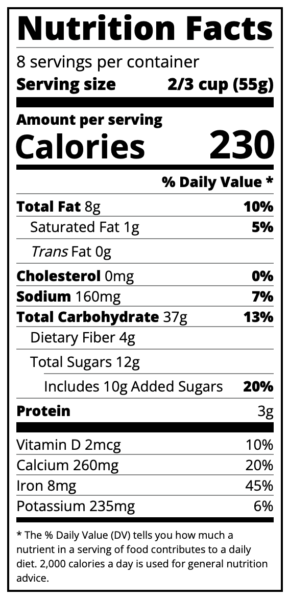

# Typography

## Description

This is the from the Learn Typhography by Building a Nutrition Label course inside (New) Responsive Web Design Certification at FreeCodeCamp.org

## Lessons learned
- fonts like Open Sans need to be imported in a link (<link href="https://fonts.googleapis.com/css?family=Open+Sans:400,700,800" rel="stylesheet">)
- In HTML if I use two classes separated by spaces, we are using one and the other.
In CSS if I use two classes separated by spaces, we are using one the is child of the other.
In CSS if I use two classes separated by commas, we are using one and the other.
- rem is a percentage of the body font-size property
- the :not pseudoselector can be used to select all selectors but one.

