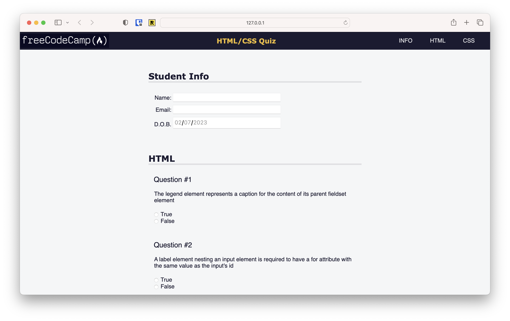

# Accessibility

## Description

This is the from the Learn Accessibility by Building a Quiz course inside (New) Responsive Web Design Certification at FreeCodeCamp.org

## Lessons learned
- use of semantic elements (such as header, main, nav...) makes SEO and accessibility better
- how to use a form with post action and some input types such as email and date
- use of @media() to query for screen-size and user-preferences
- wider use of selectors as nav > ul > li:hover, .info label, .info input and p::before 

